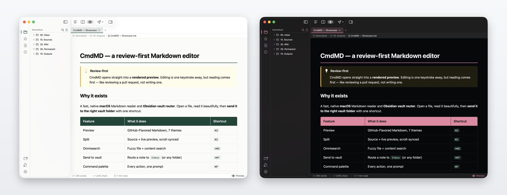
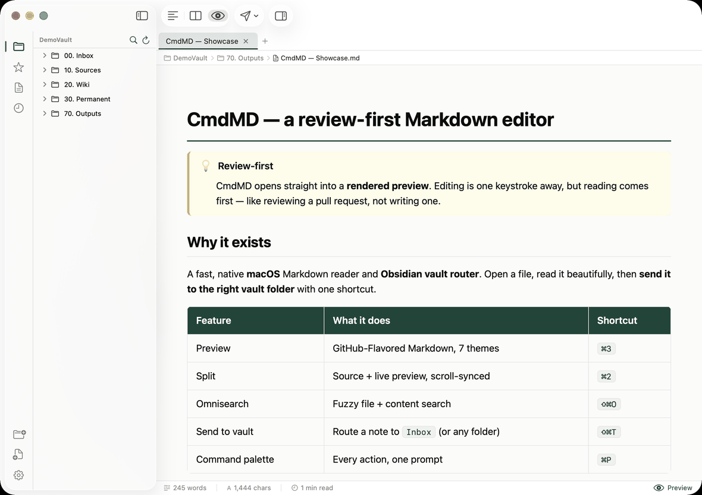
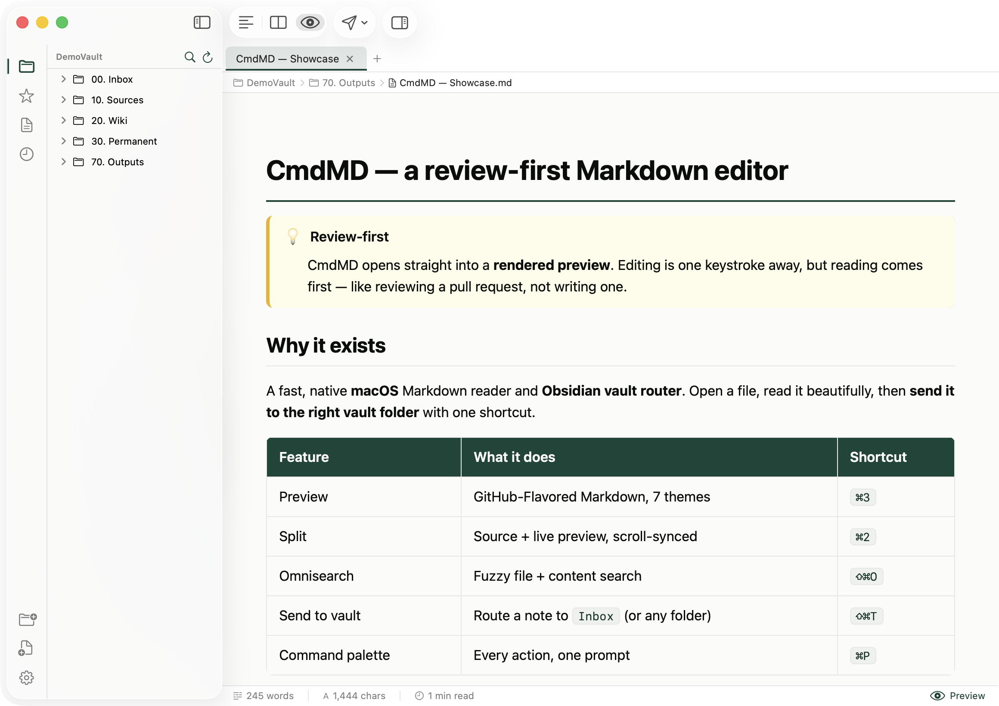
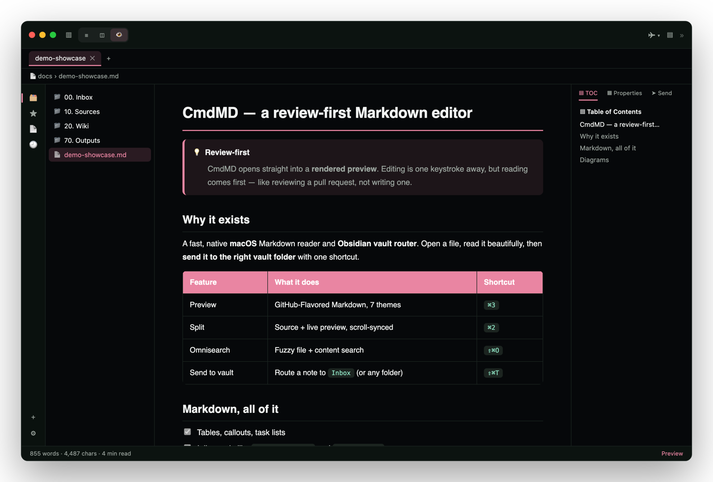
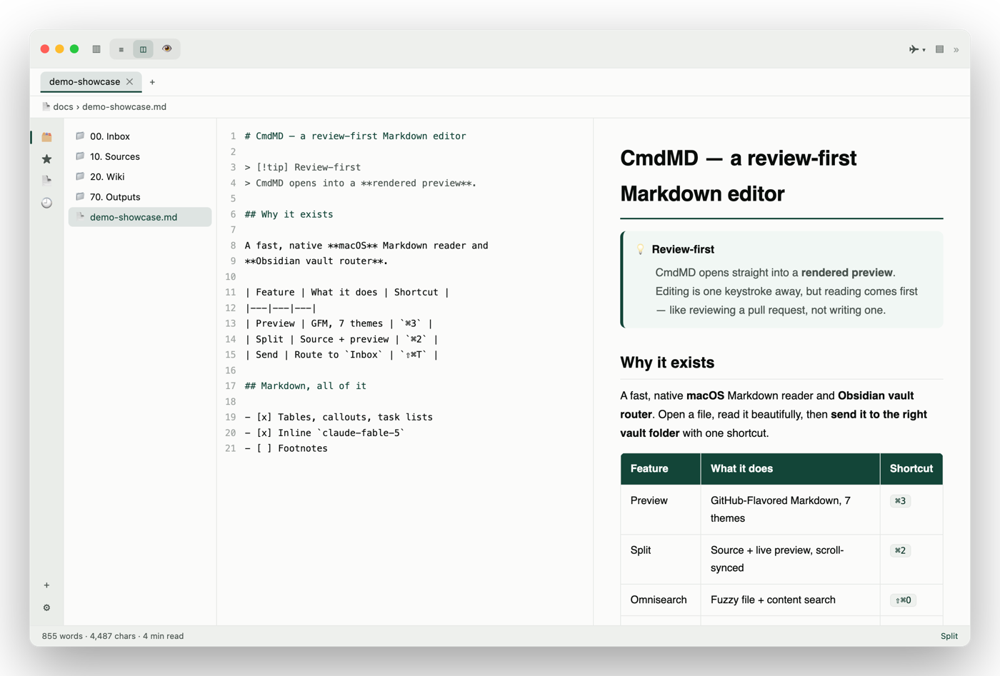
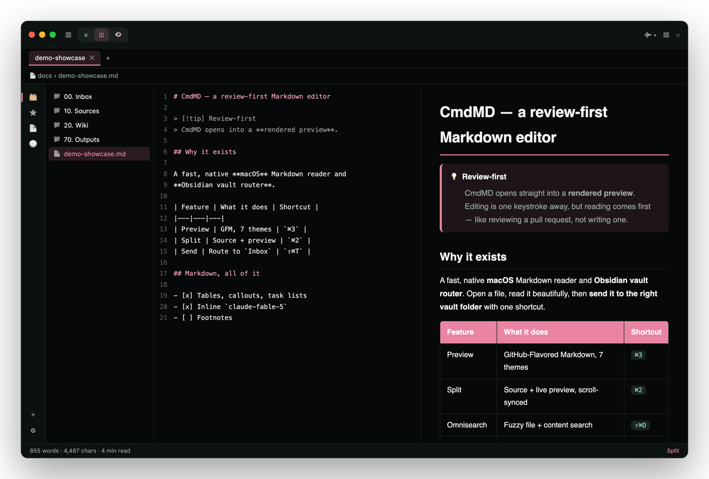

<div align="center">


# CmdMD

**A review‑first Markdown editor & Obsidian vault router for macOS.**

Open a note, read it beautifully, then send it to the right vault folder — one keystroke each.
Native Swift / SwiftUI · macOS 14+ · CMDS‑branded, light & dark.

**[cmdmd.cmdspace.work](https://cmdmd.cmdspace.work)** · [Download](https://github.com/johnfkoo951/CmdMD/releases/latest) · [Website source](https://github.com/johnfkoo951/CmdMD-web)

<br/>



<br/>
<br/>



</div>

---

> **이 저장소는 [CmdMD](https://github.com/johnfkoo951/CmdMD)(MIT, 구요한/CMDSPACE)의 포크 `cmd-docu`입니다.**
> 원본의 마크다운 리더 위에 이미지 보기를 더했고, 한글/오피스 문서 처리·Claude 연동·내용 검색을 향해 개발 중인 개인용 도구입니다.
> 원작자와 라이선스(MIT) 고지는 그대로 유지합니다. 원본과 무관하며 원작자의 보증을 받지 않았습니다.

---

## Why CmdMD

Most Markdown apps open into an editor. CmdMD opens into a **rendered preview** — reading
comes first, editing is one keystroke away (like reviewing a pull request, not writing one).
It speaks **Obsidian‑flavored Markdown** and acts as a **router**: capture or open a note,
then file it into the correct vault folder with templates and rules.

## Screenshots

| Preview — Light | Preview — Dark |
|---|---|
|  |  |

| Split (source + preview) — Light | Split — Dark |
|---|---|
|  |  |

> The accent follows your appearance — **CMDS Green** in light, **CMDS Pink** in dark.

## Features

- **Review‑first** — launches into a rendered preview; `⌘1`/`⌘2`/`⌘3` flips Source / Split / Preview.
- **Full Markdown** — GitHub‑Flavored (tables, task lists, strikethrough) plus Obsidian
  extensions: `[[wiki‑links]]`, `#tags`, `> [!callouts]`, `==highlights==`.
- **Mermaid 11 + KaTeX** — diagrams and math (`$…$`, `$$…$$`, `\[…\]`, `\(…\)`) with `\ce{}` chemistry.
- **7 preview themes** — CMDS, GitHub, Obsidian, Minimal, Sepia, Newsprint, Dark Pro — plus
  syntax‑highlighted source themes that follow light / dark.
- **Obsidian vault router** — auto‑detects your installed vaults, sends notes to any folder,
  with **templates**, **routing rules** (auto‑route by tag / filename / content), and a per‑vault Inbox.
- **Omnisearch** (`⇧⌘O`) — fuzzy file‑name + debounced content search.
- **Command palette** (`⌘P`) and **fully remappable shortcuts** (Settings → Shortcuts).
- **Tabs**, split **scroll‑sync**, **drafts**, **Quick Capture** (menu bar + global hotkey),
  a frontmatter **inspector**, slug‑accurate **TOC**, and **HTML / PDF export**.

## Install

### Download (recommended)

Grab the latest build from the [**Releases**](../../releases) page:

- **`CmdMD-<version>.dmg`** — open it and drag `CmdMD.app` onto the **Applications** shortcut.
- **`CmdMD-macos.zip`** — unzip and move `CmdMD.app` to `/Applications` (same thing, no mount).

The app is **ad‑hoc signed**, so on first launch Gatekeeper may warn. Either right‑click →
**Open**, or clear the quarantine flag:

```bash
xattr -dr com.apple.quarantine /Applications/CmdMD.app
```

### Build from source

Requires Xcode 15+ (Swift 5.9+) on macOS 14+.

```bash
git clone https://github.com/johnfkoo951/CmdMD.git
cd CmdMD

swift build                         # debug build
swift run                           # run it
swift test                          # 57 tests

swift build -c release              # release binary
bash scripts/package_app.sh         # → dist/CmdMD.app + dist/CmdMD-macos.zip
```

## Keyboard shortcuts

Defaults mirror common Obsidian bindings; every action is remappable in **Settings → Shortcuts**.

| Action | Shortcut | | Action | Shortcut |
|---|---|---|---|---|
| Command palette | `⌘P` | | Send to vault | `⇧⌘T` |
| Omnisearch | `⇧⌘O` | | Auto‑route send | `⌃⌘T` |
| Source / Split / Preview | `⌘1` `⌘2` `⌘3` | | Quick capture | `⇧⌘M` |
| Toggle left sidebar | `⌃⌘←` | | New draft | `⌘N` |
| Toggle right sidebar | `⌃⌘→` | | Save / Save As | `⌘S` `⇧⌘S` |
| Copy file path | `⌥⌘C` | | Find in document | `⌘F` |

## Sending to a vault

CmdMD connects to your Obsidian vaults (it reads Obsidian's own registry to offer one‑click
connect). When you **Send** (`⇧⌘T`), a note is copied or moved into a destination folder:

- A **global default send folder** (Settings → Vaults) applies everywhere…
- …unless a vault sets its own **Inbox**, which takes priority.
- **Routing rules** auto‑route by tag, filename, frontmatter, or content (`⌃⌘T`).
- **Templates** rewrite the filename and wrap the body (`{{title}}`, `{{date}}`, `{{content}}`, …).

## Tech

Swift / SwiftUI · [swift‑markdown](https://github.com/apple/swift-markdown) ·
[Highlightr](https://github.com/raspu/Highlightr) · [Yams](https://github.com/jpsim/Yams) ·
Mermaid & KaTeX via CDN. App data lives in `~/Library/Application Support/CmdMD/`.
The `cmdmd://open?note=<name>` URL scheme resolves a note against the open folder and vaults.

## License

[MIT](LICENSE) © 2026 CMDSPACE · 구요한
