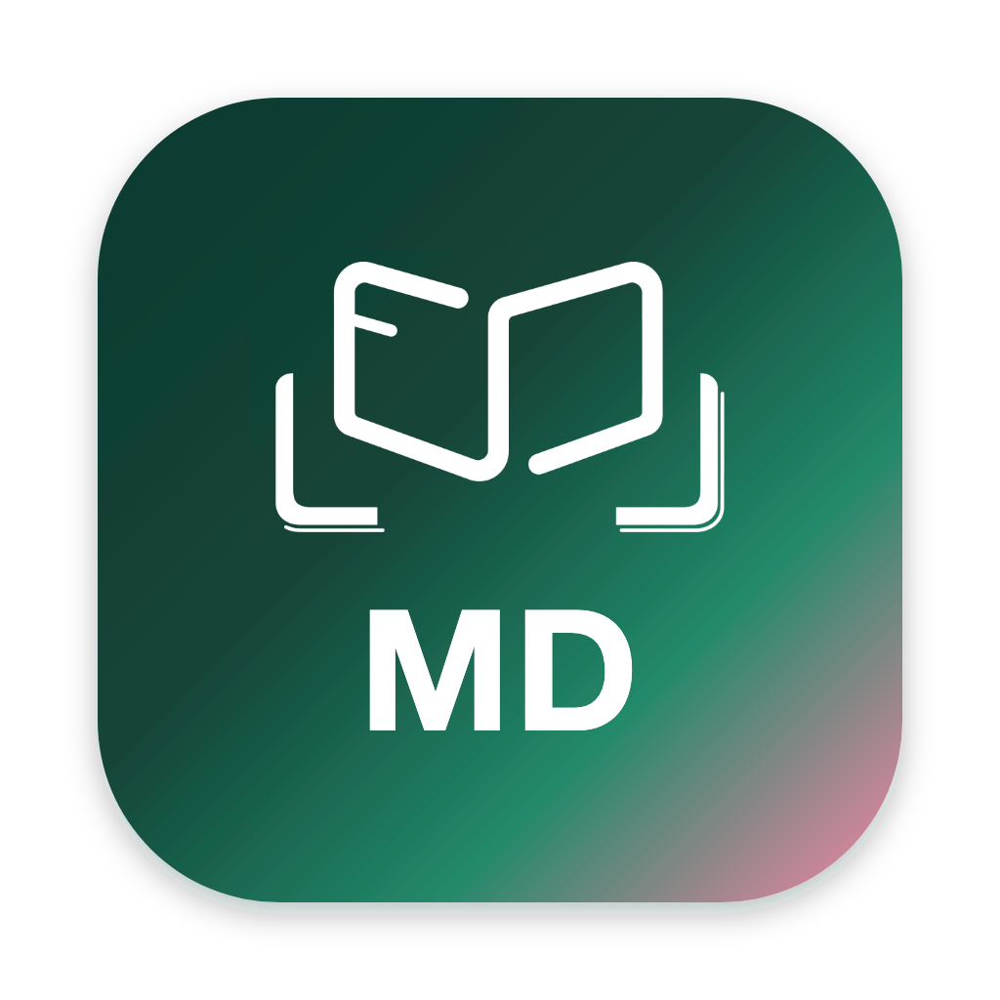
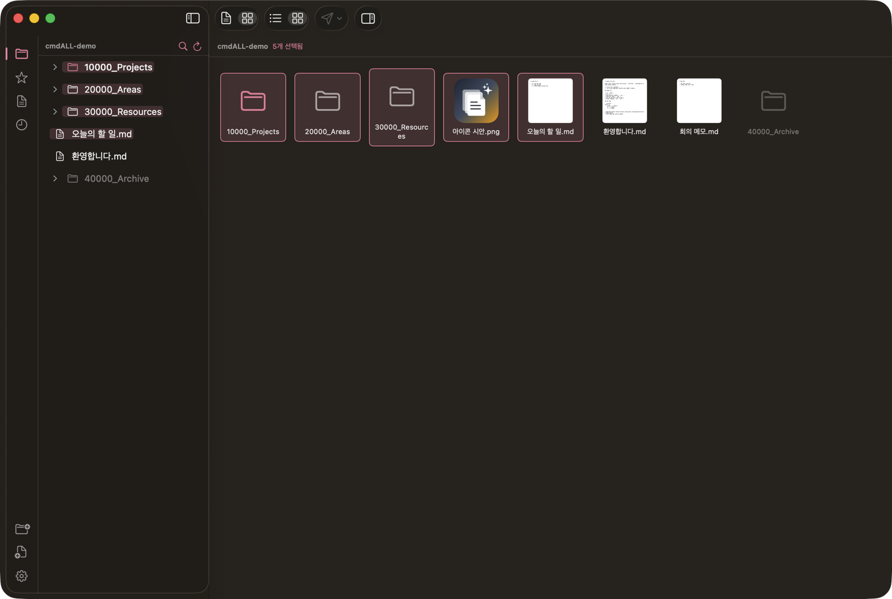
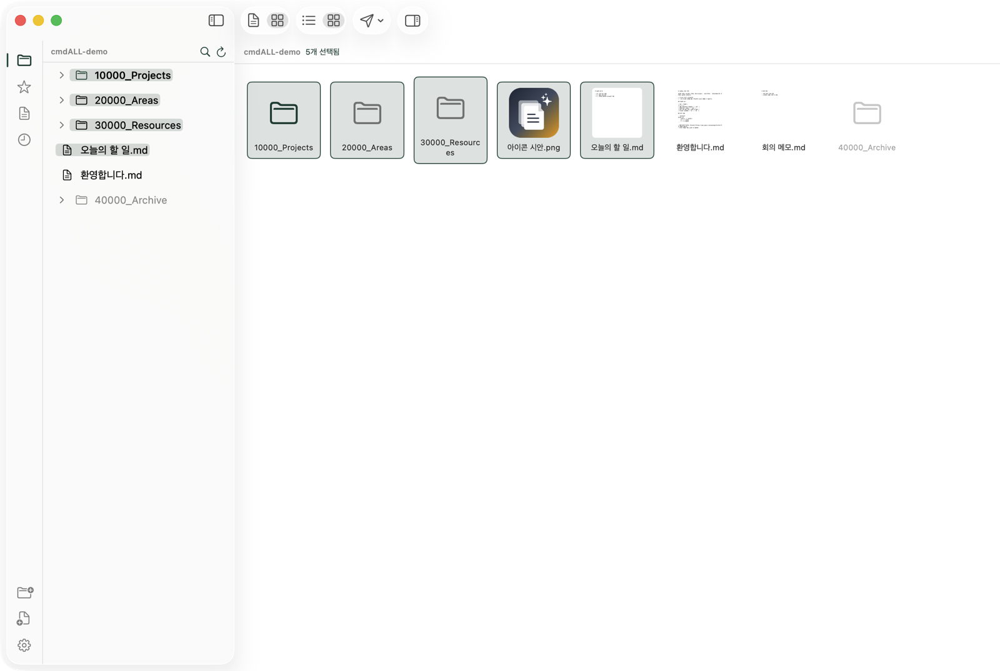
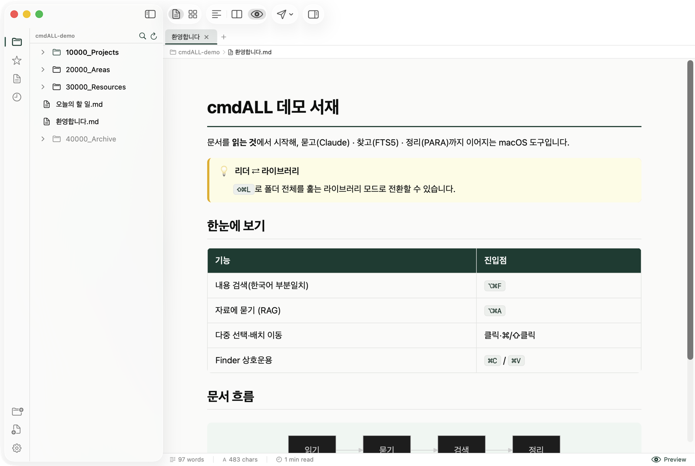
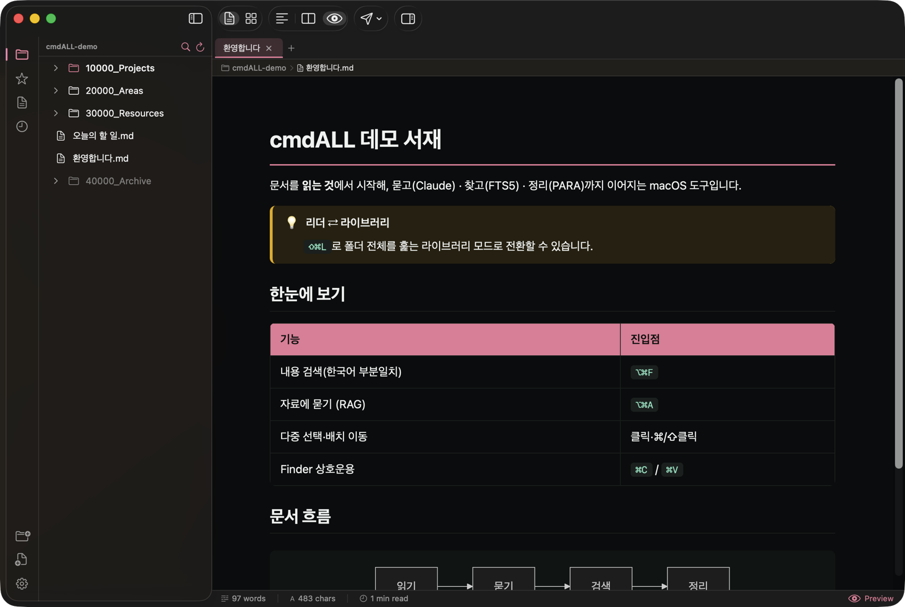

<div align="center">



# cmdALL

**문서·이미지·사운드·동영상을 읽고, Claude에게 묻고, 내용으로 검색해 알맞은 자리로 정리하는 macOS 도구.**

마크다운·PDF·이미지·한글/오피스·미디어를 한 앱에서 열어 읽고,
내용 검색(FTS5)·자료에 묻기(RAG)·PARA 라우팅·파일 관리로 이어집니다.
Native Swift / SwiftUI · macOS 14+ · light & dark.

**[Download](https://github.com/learn-slowly/cmd-docu/releases/latest)**

<br/>



</div>

---

> **이 저장소는 [CmdMD](https://github.com/johnfkoo951/CmdMD)(MIT, 구요한/CMDSPACE)의 포크 `cmdALL`입니다(저장소명은 `cmd-docu`).** 원본 프로젝트: [cmdmd.cmdspace.work](https://cmdmd.cmdspace.work) · [Website source](https://github.com/johnfkoo951/CmdMD-web)
> 원본의 마크다운 리더 위에 **이미지·PDF 보기**, **한글/오피스(HWP·DOCX·XLSX) 읽기**, **HWP/HWPX 편집·양식 채우기(서식 보존)**, **종류를 가로지르는 내용 검색(FTS5 인덱스·한국어 부분일치)**, **Claude 연동(`claude -p`) — 문서 질의·자료에 묻기(RAG)·PARA 라우팅·폴더 정리**, **PARA 라이브러리 뷰**를 더한 개인용 도구입니다.
> 문서 엔진은 외부 CLI [kordoc](https://www.npmjs.com/package/kordoc), AI는 로컬 `claude` CLI를 `Process`로 호출합니다(앱에 재구현하지 않음).
> 원작자와 라이선스(MIT) 고지는 그대로 유지합니다. 원본과 무관하며 원작자의 보증을 받지 않았습니다.

---

## Why cmdALL

Most document apps open into an editor. cmdALL opens into a **rendered preview** — reading
comes first, editing is one keystroke away (like reviewing a pull request, not writing one).
That reading surface now spans **Markdown, PDF, images, HWP/Office, and media**, and what you
read connects onward: content search, ask-your-corpus (RAG), PARA routing, file management.

## Screenshots

| Library (PARA 렌즈·다중 선택) — Light | Library — Dark |
|---|---|
|  |  |

| Preview (콜아웃·표·Mermaid) — Light | Preview — Dark |
|---|---|
|  |  |

> The accent follows your appearance — **CMDS Green** in light, **CMDS Pink** in dark.

## Features (upstream CmdMD)

- **Review‑first** — launches into a rendered preview; `⌘1`/`⌘2`/`⌘3` flips Source / Split / Preview.
- **Full Markdown** — GitHub‑Flavored (tables, task lists, strikethrough) plus Obsidian
  extensions: `[[wiki‑links]]`, `#tags`, `> [!callouts]`, `==highlights==`.
- **Mermaid 11 + KaTeX** — diagrams and math (`$…$`, `$$…$$`, `\[…\]`, `\(…\)`) with `\ce{}` chemistry.
- **7 preview themes** — CMDS, GitHub, Obsidian, Minimal, Sepia, Newsprint, Dark Pro — plus
  syntax‑highlighted source themes that follow light / dark.
- **Obsidian vault router** — auto‑detects your installed vaults, sends notes to any folder,
  with **templates**, **routing rules** (auto‑route by tag / filename / content), and a per‑vault Inbox.
- **Omnisearch** (`⇧⌘O`) — fuzzy file‑name + debounced content search.
- **Command palette** (`⌘P`) and **fully remappable shortcuts** (Settings → Shortcuts).
- **Tabs**, split **scroll‑sync**, **drafts**, **Quick Capture** (menu bar + global hotkey),
  a frontmatter **inspector**, slug‑accurate **TOC**, and **HTML / PDF export**.

## cmd‑docu 포크가 더한 것

리더를 마크다운 너머로 넓히고, 읽은 문서를 바로 질의·검색·편집하는 흐름을 더했습니다. 외부 도구(kordoc·claude)는 `Process`로 호출하며 앱에 재구현하지 않습니다.

- **이미지 리더** — png/jpg/heic/webp/gif 탭 보기(줌·팬·맞춤, GIF 재생).
- **PDF 리더** — PDFKit 기반(페이지·썸네일·문서 내 검색·회전·선택/복사).
- **한글·오피스 읽기** — HWP·HWPX·HWPML·DOC·DOCX·XLS·XLSX를 [kordoc](https://www.npmjs.com/package/kordoc)으로 마크다운 변환해 읽기전용 표시(원본 보존).
- **서식 보존 편집·저장(HWP/HWPX)** — 변환 마크다운을 편집모드로 고치고 `kordoc patch`로 **원본 서식을 보존한 채 새 파일로 저장**(원본은 절대 덮어쓰지 않음, 저장 전 경로 확인).
- **양식 채우기(HWP/HWPX)** — `kordoc fill`로 서식의 빈칸 필드를 감지해 입력 폼으로 보여주고, 값을 채운 **새 `(채움).hwpx`로 저장**(원본 불변, 저장 전 경로 확인).
- **종류를 가로지르는 폴더 검색** — 파일명 + 본문(마크다운·PDF·HWP/오피스)까지 검색, 결과에서 페이지·줄로 점프.
- **내용 검색 인덱스(FTS5)** — 폴더를 등록하면 본문을 SQLite FTS5로 영속 인덱싱하고 파일 감시로 자동 재인덱싱. **한국어 조사·복합어도 부분일치** — trigram 토크나이저 + 3글자 미만 검색어는 LIKE 폴백("평가서"로 "평가서에", "선거"로 "지방선거"를 찾음).
- **Claude 연동(`⇧⌘A`)** — 열린 문서(또는 선택 영역)를 로컬 `claude` CLI(`claude -p`)에 보내고 답을 전용 사이드 패널에 표시.
- **자료에 묻기(RAG)** — 질문하면 등록된 인덱스에서 FTS5로 근거를 추리고 Claude가 **근거만으로** 답변. 출처 `[n]` 클릭 → 마크다운은 줄, PDF는 페이지로 점프(한글/오피스는 문서 열기까지). 임베딩·외부 서버 없음, 근거가 없으면 답변을 생성하지 않습니다.
- **Claude 스마트 라우팅(PARA)** — 노트를 볼트로 보낼 때 규칙에 안 걸리면 Claude가 본문을 읽고 설정된 PARA 폴더 중 하나를 이유와 함께 제안. 이동은 확인(Send) 후에만, 자동 라우팅 연동은 기본 OFF.
- **폴더 정리(배치)** — 어수선한 폴더를 Claude가 분류 스킴 제안 → 파일 배정 → 행별로 승인한 항목만 이동. **삭제 없음**, 배치 단위 undo(이동 로그).
- **미디어 플레이어 + 짝꿍 노트** — 음악(mp3·m4a·aac·wav·aiff·flac)·동영상(mp4·mov·m4v)을 열면 플레이어와 짝꿍 마크다운 노트(`파일명.ext.md`)가 한 화면에. 길이·제목은 자동으로 채워지고, 메모는 기존 검색·RAG에 그대로 걸립니다(재생하지 않고도 그 파일이 뭔지 아는 것).
- **PARA 라이브러리 뷰** — 리더⇄라이브러리 모드 토글로 폴더를 격자/리스트로 훑기(QuickLook 썸네일). 사이드바는 PARA 렌즈(Projects 강조·Archive 흐리게), 폴더별 보기 방식을 기억.
- **파일 관리(F1a·F1b)** — 트리·라이브러리 우클릭으로 이름 변경·새 폴더·휴지통 이동(확인 후 실행, 영구 삭제 없음). **다중 선택**(라이브러리 클릭=선택·⌘/⇧클릭·⌘A, 더블클릭=열기 — Finder식)과 **배치 이동·복사·휴지통**, `⌘C`/`⌘V`/`⌥⌘V`는 **Finder와 양방향 상호운용**(페이스트보드 .fileURL). 모든 작업이 **로그에 남아 앱 안에서 배치 단위로 되돌리기** 가능(복사 되돌리기도 사본을 휴지통으로 — 영구 삭제 없음). `⌥⌘I` 정보 보기(크기·날짜·해상도/페이지/길이, 폴더 크기 비동기 계산)와 라이브러리 리스트의 크기·수정일 열까지 — 파일 몇 개 옮기려고 Finder를 열 일이 없습니다.
- **탐색 강화(F3)** — 리더·라이브러리 공용 **클릭 가능 경로 바**(‹ › 히스토리 버튼, 루트 밖 조상 클릭 시 그 폴더로 작업 폴더 전환), **뒤로/앞으로 폴더 히스토리**(`⌘[`/`⌘]`, 세션 내), 라이브러리 **상위 폴더**(`⌘↑`). **정렬**은 PARA 기본·이름·수정일·크기·종류 중 선택(툴바 메뉴 또는 리스트 열 헤더 클릭, 재클릭으로 방향 토글) — 폴더별로 기억되고 사이드바 트리에도 그대로 적용됩니다.

> 외부 도구가 없으면 해당 기능만 안내 후 비활성화되고, 앱은 크래시하지 않습니다.
> kordoc은 Node 18+가 필요하고(`npx kordoc`), Claude 연동은 로컬 `claude` 로그인이 선행됩니다.

## Install

### Download (recommended)

Grab the latest build from the [**Releases**](../../releases) page:

- **`cmdALL-<version>.dmg`** — open it and drag `cmdALL.app` onto the **Applications** shortcut.
- **`cmdALL-macos.zip`** — unzip and move `cmdALL.app` to `/Applications` (same thing, no mount).

The app is **ad‑hoc signed**, so on first launch Gatekeeper may warn. Either right‑click →
**Open**, or clear the quarantine flag:

```bash
xattr -dr com.apple.quarantine /Applications/cmdALL.app
```

### Build from source

Requires Xcode 15+ (Swift 5.9+) on macOS 14+.

```bash
git clone https://github.com/learn-slowly/cmd-docu.git
cd cmd-docu

swift build                         # debug build
swift run                           # run it
swift test                          # 553 tests (XCTest 535 + Swift Testing 18, 정식 Xcode 필요)

swift build -c release              # release binary
bash scripts/package_app.sh         # → dist/cmdALL.app + dist/cmdALL-macos.zip
```

> 포크 기능 사용 전제: 한글/오피스 변환·편집은 **Node 18+**(`npx kordoc`), Claude 연동은 로컬 **`claude`** CLI 로그인.

## Keyboard shortcuts

Defaults mirror common Obsidian bindings; every action is remappable in **Settings → Shortcuts**.

| Action | Shortcut | | Action | Shortcut |
|---|---|---|---|---|
| Command palette | `⌘P` | | Send to vault | `⇧⌘T` |
| Omnisearch | `⇧⌘O` | | Auto‑route send | `⌃⌘T` |
| Source / Split / Preview | `⌘1` `⌘2` `⌘3` | | Quick capture | `⇧⌘M` |
| Toggle left sidebar | `⌃⌘←` | | New draft | `⌘N` |
| Toggle right sidebar | `⌃⌘→` | | Save / Save As | `⌘S` `⇧⌘S` |
| Copy file path | `⌥⌘C` | | Find in document | `⌘F` |
| Ask Claude | `⇧⌘A` | | | |
| Search index (내용 검색) | `⌥⌘F` | | Ask corpus (자료에 묻기) | `⌥⌘A` |
| Reader ⇄ Library | `⇧⌘L` | | Folder cleanup (폴더 정리) | `⌥⌘K` |
| File info (정보 보기) | `⌥⌘I` | | Close all tabs | `⌥⌘W` |

## Sending to a vault

cmdALL connects to your Obsidian vaults (it reads Obsidian's own registry to offer one‑click
connect). When you **Send** (`⇧⌘T`), a note is copied or moved into a destination folder:

- A **global default send folder** (Settings → Vaults) applies everywhere…
- …unless a vault sets its own **Inbox**, which takes priority.
- **Routing rules** auto‑route by tag, filename, frontmatter, or content (`⌃⌘T`).
- **Templates** rewrite the filename and wrap the body (`{{title}}`, `{{date}}`, `{{content}}`, …).

## Tech

Swift / SwiftUI · [swift‑markdown](https://github.com/apple/swift-markdown) ·
[Highlightr](https://github.com/raspu/Highlightr) · [Yams](https://github.com/jpsim/Yams) ·
Mermaid & KaTeX bundled locally (CDN fallback). App data lives in `~/Library/Application Support/CmdMD/`.
The `cmdmd://open?note=<name>` URL scheme resolves a note against the open folder and vaults.

포크 추가 분은 보기에 **PDFKit**(PDF)·**ImageIO/AppKit**(이미지), 문서 변환·편집에 외부 CLI
[**kordoc**](https://www.npmjs.com/package/kordoc)(Node), AI 질의에 로컬 **`claude`** CLI를
`Process`로 호출합니다. 내용 검색·RAG 근거는 **SQLite FTS5**(macOS 내장, trigram 토크나이저)
로컬 인덱스를 씁니다. 외부 도구는 비샌드박스 환경에서 서브프로세스로 실행됩니다.

## License

[MIT](LICENSE) © 2026 CMDSPACE · 구요한
