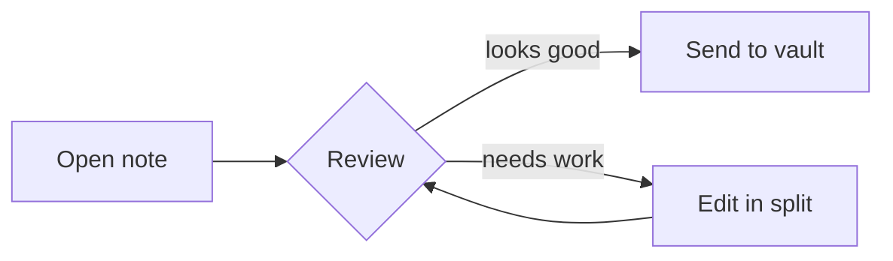

# CmdMD — a review‑first Markdown editor

> [!tip] Review-first
> CmdMD opens straight into a **rendered preview**. Editing is one keystroke away,
> but reading comes first — like reviewing a pull request, not writing one.

## Why it exists

A fast, native **macOS** Markdown reader and **Obsidian vault router**. Open a file,
read it beautifully, then **send it to the right vault folder** with one shortcut.

| Feature | What it does | Shortcut |
|---|---|---|
| Preview | GitHub‑Flavored Markdown, 7 themes | `⌘3` |
| Split | Source + live preview, scroll‑synced | `⌘2` |
| Omnisearch | Fuzzy file + content search | `⇧⌘O` |
| Send to vault | Route a note to `Inbox` (or any folder) | `⇧⌘T` |
| Command palette | Every action, one prompt | `⌘P` |

## Markdown, all of it

- [x] Tables, callouts, task lists
- [x] Inline code like `claude-fable-5` and `spawn_agent`
- [ ] Footnotes & definition lists
- Wiki‑links `[[Another Note]]` and `#tags`

```swift
// Syntax highlighting in both editor and preview
func send(_ note: Note, to vault: Vault) async throws {
    let folder = effectiveSendFolder(for: vault)   // per-vault Inbox wins
    try await write(note, into: vault.path / folder)
}
```

Math renders with KaTeX: $e^{i\pi} + 1 = 0$ and chemistry via mhchem: $\ce{H2O}$.

## Diagrams


